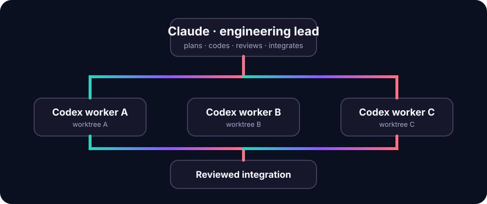

<p align="center">
  
</p>

# Tangle

Tangle is a local-first engineering workflow that lets Claude Desktop or Claude Code coordinate isolated Codex workers while retaining Claude's selected model, full project context, native tools, and ability to code directly.

**Claude leads. Codex scales. You stay in control.**

## What Tangle does

- Attaches to a clean or dirty coding session without stashing, checking out, staging, resetting, or committing on the user's branch.
- Gives each Codex worker a private Git branch, worktree, dependency-aware base, and non-overlapping ownership scope.
- Launches, polls, resumes, times out, and cancels Codex CLI workers asynchronously.
- Rejects uncommitted, empty, unrelated, or out-of-scope worker results.
- Requires Claude review before acceptance and applies only the accepted worker delta back to the active worktree.
- Preserves the active Git index during integration, including mid-session staged work.
- Stores state, prompts, logs, and worker results locally under `.tangle/`.
- Gives Claude Desktop the same bounded lifecycle through an installable MCP Bundle.
- Includes a localhost-only dashboard for task visibility, polling, and reconciliation.

The policy is **Codex-first, not Codex-only**. Claude may implement directly when work is small, architecture-sensitive, high-risk, conflict-heavy, repeatedly blocked, or explicitly assigned to Claude.

<p align="center">
  
</p>

## Requirements

- macOS or Linux
- Git
- Python 3.10 or newer
- Codex CLI, installed and authenticated (Tangle also detects the CLI bundled with ChatGPT for macOS)
- Claude Code, or a Claude Desktop Code session with local project access

Tangle does not require `jq`, GNU `timeout`, a database, Railway, Redis, or a hosted control plane.

## Install in a project

Clone or download this repository, then run:

```bash
bash scripts/install.sh /path/to/your-project
cd /path/to/your-project
python3 .claude/tangle/tangle_orchestrator.py doctor --config tangle.json
```

The installer copies the skills to `.claude/skills/`, installs the orchestrator, MCP adapter, and dashboard under `.claude/tangle/`, and creates `tangle.json` only when one does not already exist. Re-run with `--force` to update installed Tangle files; existing skills and runtime files are backed up under `.claude/tangle/backups/`, and the project's `tangle.json` is preserved.

For a manual install, copy `skills/` to `.claude/skills/`, the three `scripts/tangle_*.py` runtime files to `.claude/tangle/`, and `tangle.example.json` to `tangle.json`.

## Claude Desktop extension on Mac

Tangle ships as a current MCP Bundle (`.mcpb`), the format that replaced the older `.dxt` extension name. Build it with:

```bash
python3 scripts/build_mcpb.py
```

Then in Claude Desktop open **Settings → Extensions → Advanced settings → Install Extension…**, choose `dist/tangle.mcpb`, and select the root folder of the Git project you want Tangle to manage. The bundle contains the MCP adapter, orchestrator, dashboard, and icon; it does not install a server or send Tangle state to a hosted Tangle service.

The extension fixes its access to the one project folder selected during installation. Its MCP tools have no arbitrary shell command or arbitrary-path escape. Claude can use the full worker lifecycle, but `accept` remains an explicit review action and `integrate` still revalidates the accepted commit and preserves the index.

See [Claude Desktop and MCP setup](docs/CLAUDE_DESKTOP.md) for installation, Claude Code registration, updating, and troubleshooting.

## Local dashboard

Open the dashboard directly from an installed project:

```bash
python3 .claude/tangle/tangle_dashboard.py --repo "$PWD" --open
```

Or ask Claude to use `tangle_open_dashboard` through the extension. The dashboard binds only to `127.0.0.1`, loads no remote assets, requires a per-process token for actions, rejects non-local Host headers, and exposes only **poll** and **reconcile**. It cannot accept or integrate worker output. Use **Stop dashboard** in the page when finished.

## Use from Claude

Start with `/tangle-init YourProject` once. Then use `/tangle-1-plan <feature>`, `/tangle-orchestrate <approved plan>`, or `/tangle-2-implement <plan>`.

The orchestration skill drives the helper, but the equivalent lifecycle is visible here:

```bash
TANGLE=.claude/tangle/tangle_orchestrator.py

python3 "$TANGLE" init --config tangle.json
python3 "$TANGLE" snapshot --label active-session

python3 "$TANGLE" create-worker T1 \
  --title "Implement billing API" \
  --owns 'src/billing/**' \
  --acceptance "Billing requests are validated" \
  --test "pytest tests/billing"

python3 "$TANGLE" launch T1
python3 "$TANGLE" poll T1

# Claude reviews the committed diff and runs the applicable tests.
python3 "$TANGLE" accept T1 --review-note "Diff and tests reviewed"
python3 "$TANGLE" integrate T1
python3 "$TANGLE" cleanup T1 --delete-branch
```

`integrate` applies the reviewed worker delta as unstaged changes in Claude's active worktree. It never merges the private snapshot commit and never alters the existing staging area. Claude can inspect, adjust, stage, and commit the combined result normally.

For a dependent task, pass `--depends-on T1`. Tangle starts it only after T1 is accepted, composes T1's accepted changes into the new worker's private base, and later requires T1 to be integrated first.

## Commands

| Command | Purpose |
| --- | --- |
| `doctor` | Verify Git, Python, Codex, state, and configuration |
| `init` | Create state safely; repeated calls preserve existing tasks |
| `configure` | Reload a validated `tangle.json` without resetting tasks |
| `snapshot` | Capture the current clean or dirty session non-destructively |
| `create-worker` | Validate dependencies and ownership, then create a worktree |
| `launch` / `poll` | Run Codex asynchronously and collect its result |
| `resume` / `cancel` | Give bounded feedback or safely stop a worker |
| `complete` | Validate a worker completed outside the built-in launcher |
| `accept` | Record Claude's review gate |
| `integrate` | Apply only the reviewed task delta, preserving the index |
| `cleanup` / `reconcile` | Safely retire tasks or repair stale local metadata |
| `prune-runtime` | Preview or remove expired attempt artifacts for cleaned terminal tasks |
| `status` | Print compact persistent task state |

The MCP adapter exposes bounded equivalents of these lifecycle commands plus `tangle_open_dashboard`. It deliberately exposes no generic command runner.

Use `python3 .claude/tangle/tangle_orchestrator.py <command> --help` for command-specific options.

Ordinary `status` output is bounded to current work plus the most recent history so MCP and dashboard responses stay small. Use `status --full` locally when older task records are needed.

## Configuration

The checked-in [tangle.example.json](tangle.example.json) is the complete schema. Tangle rejects unknown fields, wrong types, unsafe worktree paths, unsupported adapters, and `danger-full-access` workers with concise errors.

The default worker is `gpt-5.6-luna` at `high` reasoning on the fast service tier. Change the Codex worker model in `tangle.json` and run `configure`; this does not change Claude's selected model. Worker attempts default to a 30-minute timeout and one bounded retry. Tangle defaults to two configured workers and automatically lowers actual concurrent launches on smaller-memory computers; an 8 GB Mac runs one Codex worker at a time while Claude remains fully available.

Nonignored untracked files enter dirty-session snapshots by default so workers see what Claude sees. Keep secrets and machine-local files in `.gitignore`, or set `active_session.include_untracked_nonignored` to `false`.

### External storage on Mac

Tangle can place isolated worker checkouts and their build output on a specific removable volume. The volume must already be mounted, have the configured name, match the optional volume UUID, and use a Git-safe filesystem such as APFS or HFS+. Tangle rejects ExFAT, FAT, and NTFS worktree volumes because they do not reliably preserve Unix permissions and symlinks.

For a drive mounted as `/Volumes/STORAGE 1`, set this block in the project's `tangle.json`:

```json
"storage": {
  "mode": "external",
  "external_mount": "/Volumes/STORAGE 1",
  "external_volume_name": "STORAGE 1",
  "external_volume_id": "",
  "external_subdirectory": "Tangle",
  "minimum_free_gb": 5,
  "runtime_retention_days": 14
}
```

Then run `configure` and `doctor`. Tangle creates a project-specific directory on that volume, so projects cannot collide. Supplying the UUID shown by `diskutil info "/Volumes/STORAGE 1"` provides the strongest identity check.

If the drive disconnects, `status` and the dashboard report it as offline. `reconcile` preserves task state and Git worktree registrations until the same volume returns. Tangle never silently falls back to the internal disk. Essential state stays under the project's `.tangle/`; attempt reports and logs are bounded, and `prune-runtime --dry-run` previews retention cleanup.

## Where it runs

Tangle runs on your computer because it needs local source files, Git, build tools, and the authenticated Codex CLI. GitHub hosts and distributes Tangle; it is not the orchestration backend.

Runtime state is excluded locally through `.git/info/exclude` during initialization, even when the host repository has not added `.tangle/` to its own `.gitignore`.

## Reliability

The standard-library test suite covers dirty snapshots, ignored secrets, staged and untracked files, concurrent state updates, dependency composition, ownership enforcement, review gates, active-index preservation, external-volume validation and disconnects, resource limits, bounded reports, retention pruning, installation, Unicode token counting, the asynchronous worker lifecycle, MCP negotiation and tool boundaries, dashboard security, and reproducible MCP Bundle packaging. GitHub Actions runs it on macOS and Linux with Python 3.10 and 3.12.

See [the architecture](docs/ARCHITECTURE.md), [delivered buildout](BUILDOUT.md), and [continuation prompt](BUILD_PROMPT.md).

## License

No open-source license is currently granted. The copyright holder retains all rights.
